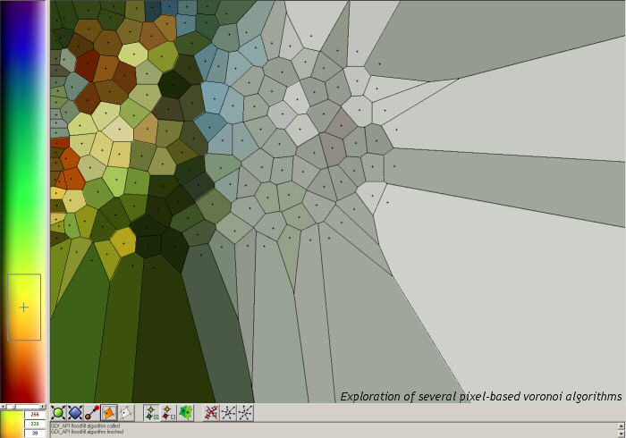



## Voronoi diagrams

### Description

Exploration of several pixel-based voronoi diagram algorithms. Voronoi diagrams are used to divide space (in this case 2D space) amongst a collection of points.

The application comes with a helpfile.
 
### More Info
 
A collection of points and colours

This code uses many GDI API calls to draw stuff into device contexes. If you're interested in such things than this might be very useful to you.

A voronoi diagram graphic

             |
---                |---
**Submitted On**   |2004-11-03 17:12:48
**By**             |[David Rutten](https://github.com/Planet-Source-Code/PSCIndex/blob/master/ByAuthor/david-rutten.md)
**Level**          |Intermediate
**User Rating**    |4.9 (78 globes from 16 users)
**Compatibility**  |VB 6\.0
**Category**       |[Complete Applications](https://github.com/Planet-Source-Code/PSCIndex/blob/master/ByCategory/complete-applications__1-27.md)
**World**          |[Visual Basic](https://github.com/Planet-Source-Code/PSCIndex/blob/master/ByWorld/visual-basic.md)
**Archive File**   |[Voronoi\_di1814141142004\.zip](https://github.com/Planet-Source-Code/david-rutten-voronoi-diagrams__1-57062/archive/master.zip)

### API Declarations

Loads of API calls. From the top of my head: MoveToEx, LineTo, Rectangle, CreateCompatibleDC, BitBlt, StretchBlt, TransparantBlt etc.

